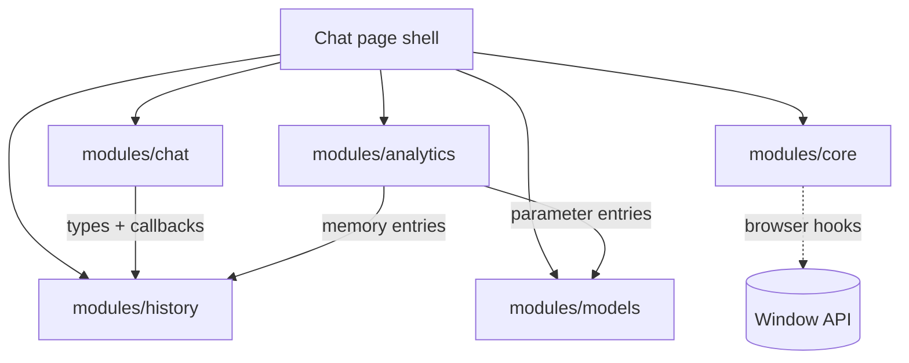

# Колибри Чат — модульная схема (ревизия ноябрь 2025)

## Карта зависимостей

## Основные роли модулей
- **`modules/chat`** — отвечает за генерацию ответа и витрины героя: `useMessageComposer` формирует сообщения и обновляет статус истории, опираясь на тип `ConversationStatus` из history-модуля.【F:frontend/src/modules/chat/index.ts†L11-L236】 Генератор `generateKolibriResponse` пока синтезирует ответы локально, поддерживая слэш-команды и вспомогательные подсказки.【F:frontend/src/modules/chat/index.ts†L238-L527】
- **`modules/history`** — управляет состоянием бесед, хранит временные сообщения и статусы, а также возвращает заготовки памяти для правого дровера.【F:frontend/src/modules/history/state.ts†L5-L129】 Модуль не зависит от других, что упрощает замену in-memory стора на сетевой источник.
- **`modules/analytics`** — агрегирует записи для правого дровера и объединяет зависимости, поступающие из history и models. Он не тянет данные напрямую, а форматирует переданные массивы и собственные заглушки метрик.【F:frontend/src/modules/analytics/index.tsx†L11-L80】
- **`modules/core`** — предоставляет кросс-срезные хуки (PWA баннер, адаптивные панели, горячие клавиши) и работает напрямую с браузерными API.【F:frontend/src/modules/core/index.ts†L14-L84】 Эти хуки вызываются из Chat page для управления глобальным состоянием оболочки.

## Точки расширения (hook points)
1. **API-слой генерации** — `generateKolibriResponse` и обработчики слэш-команд остаются в виде заглушки; интеграция с бэкендом или стримингом ответов должна заменить локальный синтез и случайную задержку.【F:frontend/src/modules/chat/index.ts†L238-L257】
2. **Командные шаблоны** — `renderCodeTemplate` содержит явный TODO-комментарий и выбрасывает `NotImplementedError`; сюда предстоит подключить реальные шаблоны и тесты, обещанные во время ревью последнего PR.【F:frontend/src/modules/chat/index.ts†L485-L516】
3. **Метрические панели** — `useHeroMetrics` и `getAnalyticsEntries` возвращают жёстко зашитые значения; требуется подключение к реальной телеметрии и моделям, чтобы выполнить задачи этапа 2 про UX-метрики.【F:frontend/src/modules/chat/index.ts†L639-L647】【F:frontend/src/modules/analytics/index.tsx†L11-L80】
4. **История бесед** — `useConversationState` использует локальные bootstrap-данные и `setTimeout`, что усложняет синхронизацию с сервером и выполнением дорожной карты по рабочим пространствам и поиску.【F:frontend/src/modules/history/state.ts†L7-L99】

## Технический долг и соответствие роадмапу
| Технический долг | Проявление в коде | Связанные пункты роадмапа |
| --- | --- | --- |
| Нет реального сервера генерации и потоковой передачи | Локальная функция `generateKolibriResponse` с искусственной задержкой и евристиками вместо API-вызова | Этап 2: «Интегрировать телеметрию UX…» требует измерять фактическую латентность, а не псевдо-ответы.【F:frontend/src/modules/chat/index.ts†L238-L257】【F:plan.md†L69-L73】 |
| Заглушечные шаблоны кода и TODO из ревью | `renderCodeTemplate` формирует заглушки с `TODO` и `NotImplementedError`, не удовлетворяя обещанной поддержке рабочих сценариев | Этап 2: «Встроить систему подсказок…» подразумевает готовые сниппеты для ассистента.【F:frontend/src/modules/chat/index.ts†L485-L516】【F:plan.md†L69-L73】 |
| Статичные метрики героя и правого дровера | `useHeroMetrics` и `getAnalyticsEntries` возвращают константы, что не позволяет выполнять KPI по UX и аналитике | Этап 2: та же секция про телеметрию UX, плюс Этап 3 о «живых» панелях и потоках данных.【F:frontend/src/modules/chat/index.ts†L639-L647】【F:frontend/src/modules/analytics/index.tsx†L11-L80】【F:plan.md†L69-L79】 |
| In-memory история без персистентности | `useConversationState` заполняет bootstrap-данные и обновляет статус через `setTimeout`, что блокирует задачи по рабочим пространствам и поиску | Этап 3: «Добавить управление рабочими пространствами… и мгновенный поиск по истории диалогов».【F:frontend/src/modules/history/state.ts†L7-L105】【F:plan.md†L75-L78】 |
| Отсутствие связи между analytics и core инструментами | Правый дровер не получает события от core-хуков или offline-очереди, из-за чего пропадает контур наблюдаемости | Этап 1: «Разложить фронтенд на модули…» отмечен как незавершенный; требуется сквозная интеграция модулей и telemetry hub.【F:frontend/src/modules/analytics/index.tsx†L20-L80】【F:plan.md†L63-L67】 |

## Следующие шаги
1. Спроектировать API-клиент для генерации ответов и внедрить стриминг, сохранив совместимость с `useMessageComposer`.
2. Заменить заглушки кода и метрик реальными провайдерами (Storybook/Playroom для шаблонов, telemetry hub для метрик).
3. Вынести состояние истории в персистентный слой (IndexedDB + синхронизация с backend) и добавить индексацию для будущего поиска.
